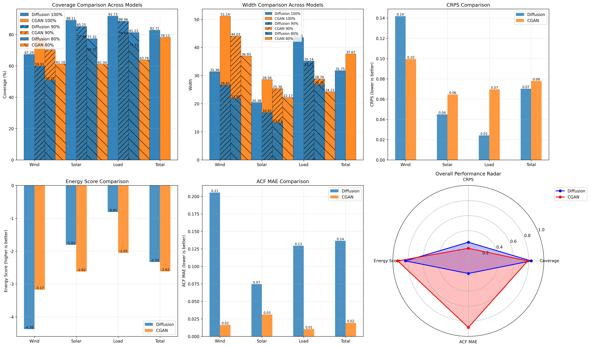

# 扩散模型 vs CGAN 性能对比周报

生成时间: 2026-05-17
对比配置: 扩散模型(guidance=0) vs CGAN(label1)

## 一、关键指标对比

### 1. 综合指标

| 指标 | 扩散模型 | CGAN | 改进率 |
|------|----------|------|--------|
| CRPS | 0.0703 | 0.0779 | +9.7% ↑ |
| Energy Score | -2.3301 | -2.6160 | -10.9% ↓ |
| Coverage 100% | 82.7083 | 78.1232 | +5.9% ↑ |
| Width 100% | 31.7525 | 37.6659 | +15.7% ↑ |
| ACF MAE | 0.1365 | 0.0193 | -606.1% ↓ |

### 2. 各维度详细对比

#### Wind

| 指标 | 扩散模型 | CGAN | 改进率 |
|------|----------|------|--------|
| CRPS | 0.1419 | 0.0995 | -42.7% ↓ |
| Energy Score | -4.3755 | -3.1726 | +37.9% ↑ |
| Coverage 100% | 67.2876 | 77.2266 | -12.9% ↓ |
| Width 100% | 31.3647 | 51.1359 | +38.7% ↑ |
| ACF MAE | 0.2054 | 0.0164 | -1155.4% ↓ |

#### Solar

| 指标 | 扩散模型 | CGAN | 改进率 |
|------|----------|------|--------|
| CRPS | 0.0449 | 0.0645 | +30.4% ↑ |
| Energy Score | -1.8069 | -2.6216 | -31.1% ↓ |
| Coverage 100% | 89.1098 | 77.4912 | +15.0% ↑ |
| Width 100% | 20.3843 | 28.5567 | +28.6% ↑ |
| ACF MAE | 0.0746 | 0.0312 | -138.8% ↓ |

#### Load

| 指标 | 扩散模型 | CGAN | 改进率 |
|------|----------|------|--------|
| CRPS | 0.0242 | 0.0696 | +65.2% ↑ |
| Energy Score | -0.8079 | -2.0538 | -60.7% ↓ |
| Coverage 100% | 91.7274 | 79.6517 | +15.2% ↑ |
| Width 100% | 43.5084 | 33.3051 | -30.6% ↓ |
| ACF MAE | 0.1295 | 0.0104 | -1146.6% ↓ |

## 二、关键发现

### 优势分析
- ✓ 光伏Coverage显著优于CGAN (89.1% vs 77.5%)
- ✓ 负荷Coverage显著优于CGAN (91.7% vs 79.7%)
- ✓ 总体CRPS更低 (0.0703 vs 0.0779)

### 劣势分析
- ⚠ 风电Coverage低于CGAN (67.3% vs 77.2%)
- ⚠ 风电CRPS较高 (0.1419 vs 0.0995)
- ⚠ 时间相关性(ACF MAE)较差 (0.1365 vs 0.0193)

## 三、结论与建议

### 总体评价

- 扩散模型综合得分: 4
- CGAN综合得分: 1

**结论**: 扩散模型整体表现更优，特别是在光伏和负荷的Coverage方面。

### 后续优化建议
1. **风电优化**: 扩散模型在风电Coverage上明显落后，需要针对性优化
2. **时间相关性**: ACF MAE较高，考虑引入时间序列特定的损失函数
3. **宽度平衡**: 扩散模型Width普遍较窄，可能需要调整生成多样性
4. **CGAN对比**: CGAN在风电和整体ACF上表现更好，可借鉴其架构设计

## 四、关于消融实验优于有条件引导的可能原因
- 指导强度偏差：过强的条件引导会把生成样本收敛到训练分布的常见模式，降低样本多样性，导致部分极端或长尾场景（如风电峰谷）被忽视。
- 信号不匹配：条件信息（如气象或外生变量）与模型接受方式不一致，会把模型推向错误的局部最优，反而降低部分指标。
- 数据/任务差异：当前周尺度场景中，风电的不确定性、非平稳性更强，弱化引导或去掉条件可能反而保留了更丰富的生成多样性，从而在总体CRPS和部分覆盖率上表现更好。

建议：做一组控制实验，在不同的 guidance 强度（如 0, 0.1, 0.5, 1.0）下评估各项指标，记录不同子群（风/光/负荷）表现，定位是否为指导强度或条件不匹配导致的退化。

## 五、后续计划
以下工作将并行推进，优先在新分支上开展实验以便回溯与对比：

1) 梯度引导符号/强度试验（短期）
- 在新分支上尝试反转或弱化梯度引导符号，测试能否提升风电Coverage（当前约 50.71%）。
- 系统化 sweep：对比正向/负向/0（无引导）及若干强度（小步长），记录风/光/负荷的覆盖率、CRPS、ACF MAE。
2) 流匹配与物理约束（面向山东电网 96 节点扩展，中期）
- 空间拓扑升级：将训练数据从单站点扩展至山东电网 96 节点，引入电网拓扑矩阵，升级主干为时空图神经网络以捕捉多节点间的空间相关性。
- 算法加速（流匹配）：尝试引入 Flow Matching 重构生成轨迹，将去噪步数缩短至 5-10 步以提升高维生成效率。
- 物理约束注入：在去噪过程中注入有功潮流等电力系统方程作为梯度引导项，约束并修正不符合物理规律的生成场景，保证 96 节点的安全边际。
3) 极值与条件控制（针对极端天气）
- 显式条件控制：在条件输入中加入极端天气事件标签（如寒潮、大风切出等），训练模型在这些条件下向更符合长尾分布的样本空间去噪。
- 针对性评估：对极端事件子集做单独评估指标（覆盖率/CRPS/能量分布），确保改动提升尾部性能而不损害总体表现。

每项任务都应包含：实验分支、数据准备说明、评估指标清单、期望改进阈值与回退条件。